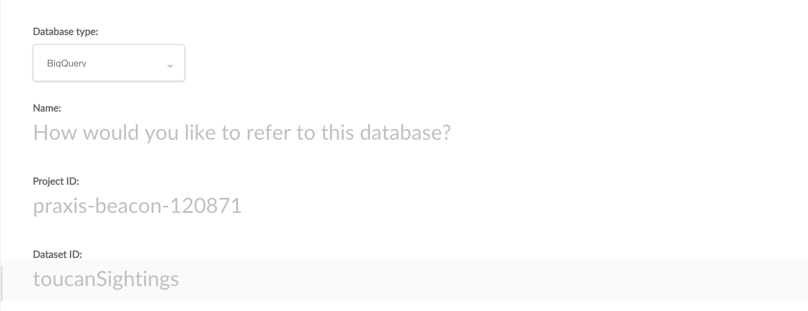
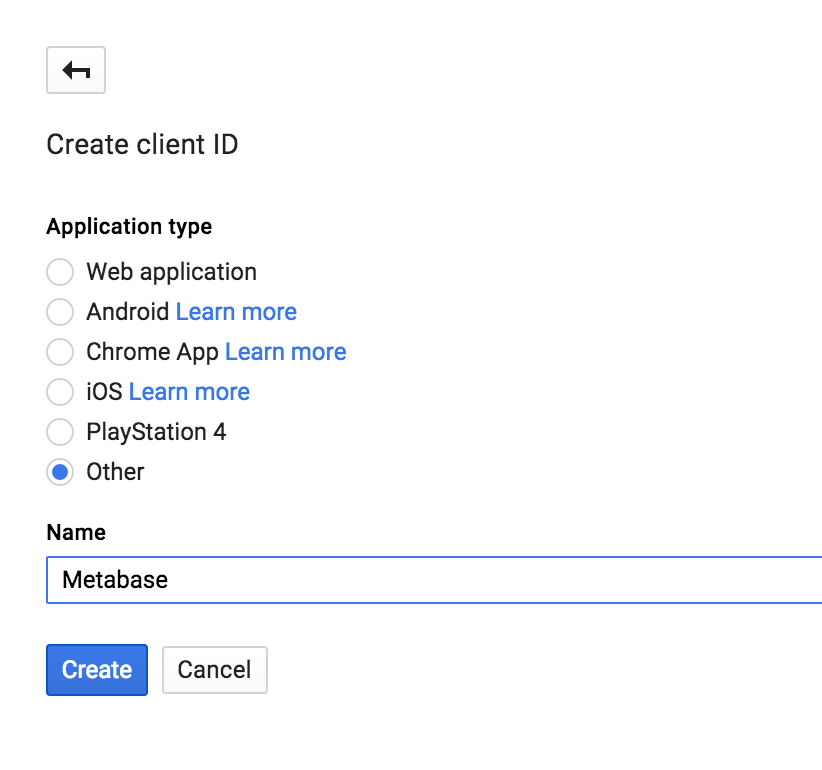
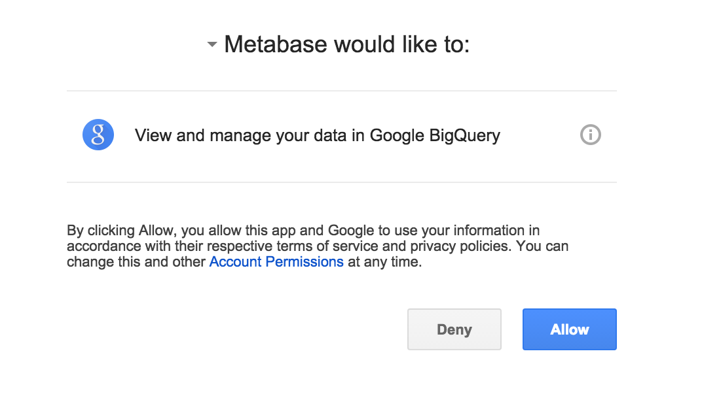

## Working with Google BigQuery in Metabase

Starting in v0.15.0 Metabase provides a driver for connecting to BigQuery directly and executing queries against any datasets you have.  The below sections provide information on how to get connected and troubleshoot any issues that may come up.

### Connecting to a BigQuery Dataset

1. make sure you have a [Google Cloud Platform](https://cloud.google.com/) account with a Project you would like to use in Metabase.
* Start by giving this connection a __Name__ and providing your Google Cloud Platform __Project ID__ along with your desired BigQuery __Dataset ID__.  If you don't have a dataset and want to play around with something we recommend copying one of the [sample tables](https://cloud.google.com/bigquery/sample-tables)

* Follow the `Click here` link provided below the __Client ID__ field which will open a new browser tab and guide you through the process of generating OAuth 2.0 credentials for Metabase.  Make sure to choose `Other` for your application type.

* take the resulting client ID and client secret and copy them over to Metabase.

* Now follow the link below the __Auth Code__ field for `Click here to get an auth code` which will open a new browser window and authorize your credentials for a BigQuery access token to use the api.  Simply click the `Allow` button.

* Copy the resulting code provided into the __Auth Code__ field in Metabase.

* Click the `Save` button!

Metabase will now begin inspecting your BigQuery Dataset and finding any tables and fields to build up a sense for the schema.  Give it a little bit of time to do its work and then you're all set to start querying.
