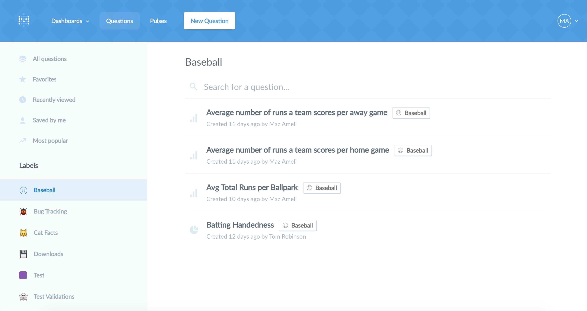

## Sharing Your Questions and Answers
---

### How to Save a Question
Whenever you’ve arrived at an answer that you want to save for later, click the **SAVE** button in the top right of the screen. This will also save the visualization option you’ve chosen for your answer.

A pop-up box will appear, you to give your question a name and a description. We suggest phrasing the names for your questions in the form of a question, such as, “How many customers did we have last month?” After saving your question, you'll be asked if you want to add it to a dashboard.

Now, whenever you want to refer to your question again, you can find it in the saved questions list by clicking on the **Questions** link from the main navigation. To edit your question, go to it and click the pencil icon in the top-right.

### Organizing and Finding your Saved Questions

After your team has been using Metabase for a while, you’ll probably end up with lots of saved questions. The Questions page has several tools that’ll help you organize things and find what you’re looking for.

#### Shortcuts
In the top left, you’ll find shortcuts to your favorite questions (mark a question as a favorite by clicking on the star icon that appears on the far right when you hover over it), questions you’ve recently viewed, questions that you’ve saved personally, and popular questions that are used the most by your team.

#### Search
You can search for a question by typing keywords into the **Search for a question** area.

#### Labels
One great way to organize your questions is to label them. Create and organize your team’s labels by clicking on the **Labels** heading in the left menu on the Questions page. To create a label, just choose a color (or emoji!) for it, give it a name, and click **Create Label**. You can edit or delete a label by hovering of a label and clicking the **Edit** or **X** icon. You can create labels that pertain to different teams, projects, products, reports, dashboards, or whatever you want!

You can assign as many labels as you want to your questions. Just hover over a question in your list and click the label icon, then pick the label(s) you want to apply to the question.

If you have several questions that you want to give the same label to, just click the checkbox on the left side of each question’s title when you hover over it to select your questions, then click the Labels dropdown at the top of the page.

Once you’ve created a label, it’ll appear in the list on the left side of the screen. Clicking on a label, either in the list of labels or on an individual question, will show you all the questions that have that label.

#### Archiving
Sometimes questions outlive their usefulness and need to be sent to Question Heaven. To archive a question, just click on the box icon that appears on the far right when you hover over a question. You can also archive multiple questions the same way you apply labels to multiple questions.

If you have second thoughts and want to bring an archived question back, you can see all your archived questions from the **Archive** link at the bottom of the left menu. To unarchive a question, hover over it and click the box icon that appears on the far right.

---

## Next: Creating dashboards
Next, we'll learn about [creating dashboards and adding questions to them](06-dashboards.md).
